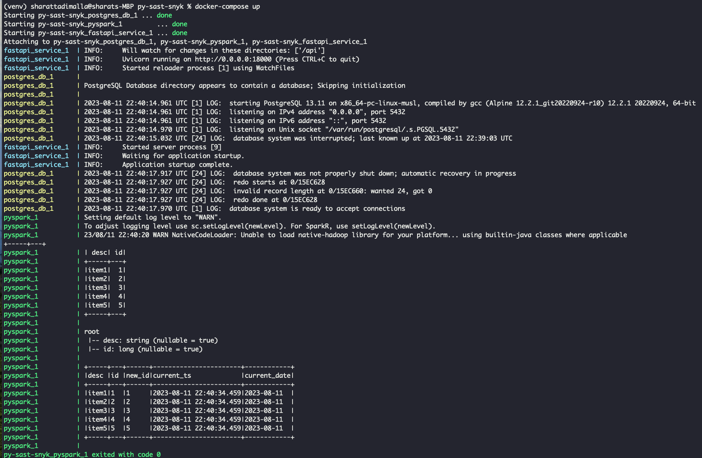
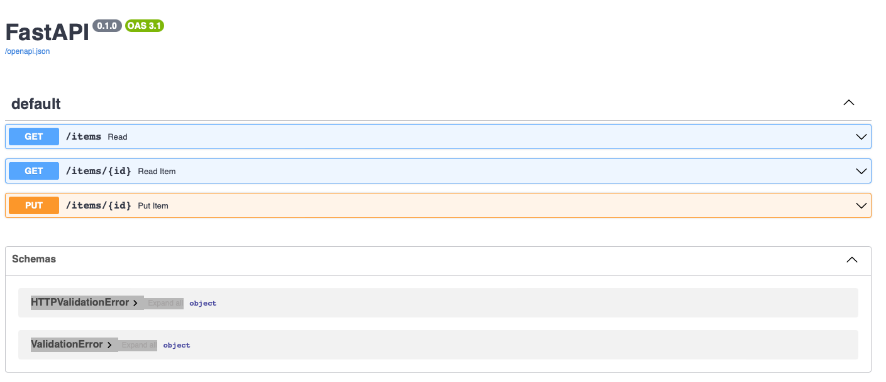
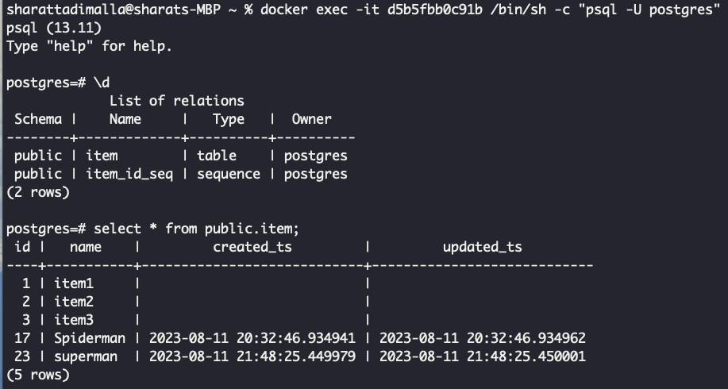
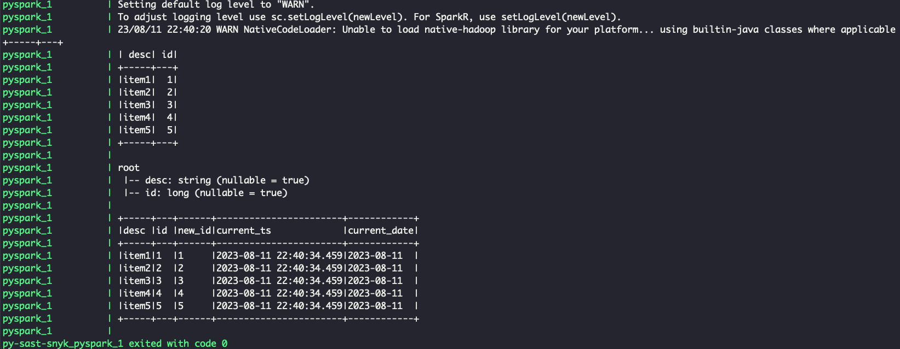

# SAST using snyk demo project

## Objectives

- Perform SAST scanning using snyk on local machine
- Integrate SAST scan using synk using CICD pipeline

## Git Hooks

1. git client side hooks serve as preventative control security gates

## Demo Project

This project includes docker containerized `API, Postgres database and Pyspark` application

### Technology Stack

- API framework - `fastapi`
- Language - `python`
- Database - `postgres`
- Big Data Tool - `Apache Spark`
- Container System - `Docker`
- Container Orchestrator - `Docker Compose`
- SAST Tool - `snyk`
- CICD Pipeline - `Azure Pipeline`

## Snyk SAST scans

Read details [here](docs/snyk_setup.md)

## Developer Setup

### Pre-requisites

- [docker-desktop](https://www.docker.com/products/docker-desktop/) installed on local machine
- Download [postgresql-42.6.0.jar](https://repo1.maven.org/maven2/org/postgresql/postgresql/42.6.0/postgresql-42.6.0.jar) jar to `resources/jars` folder

```
# run docker container
docker-compose up

# stop docker compose
docker-compose down

# access postgres db
docker exec -it <container_id> /bin/sh -c "psql -U postgres"
```

### Output

**docker-compose up**


**fast API**
Access API Swagger docs [here](http://127.0.0.1:18000/docs/)


**Postgres db**


**Pyspark Application**

