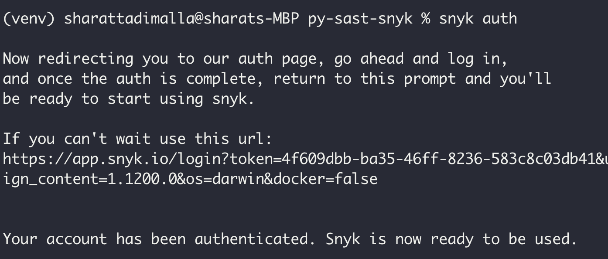

# Snyk Setup

## IDE Plugin Installing Scanning

1. Install `snyk` extension for `vscode`


2. Initiate `snyk` scan inside `vscode`


3. `snyk` scans for 
    1. Open Source Security - Find and automatically fix open-source vulnerabilities
    2. Code Security - Find and fix vulnerabilities in your application code
    3. Configurations - Find and fix insecure configurations
    4. Code Quality - 
    Identify issues and view recommended fixes. Once fixed, rescan

> NOTE:- Action Required -  Ability to pass snyk sast scan merging PR for releasing software.  

References
> https://docs.snyk.io/getting-started/getting-started-with-snyk-free-team-plan

## snyk-cli to scan projects

## mac
```
brew tap snyk/tap && brew install snyk
```

1. Authenticate with `synk` 


Redirected from CLI to web App


Confirm web authentication


Authentication success


2. Scan project with synk


3. Monitor scanned projects with synk 


4. Scan containers with synk


5. Test code with synk


6. Check for log4Shell issues with synk


